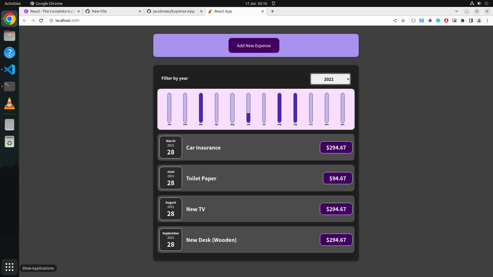

# Expense App

> This project is an expense tracker app built using React.

### Expense App Screenshot:



# Getting Started

To get a local copy of the repository please run the following commands in your terminal:

```
$ cd <folder>
```

```
$ git clone git@github.com:jacobrees/Expense-App.git
```

To launch an instance of this app. First ensure you already have React installed on your machine. Inside your terminal, you will need to navigate into the repository you have just cloned. You will do this by using `cd` inside of your terminal. 

Once you are inside of this folder run the command `npm start` to open the project in your default browser on a development server. 

Below shows the following commands you will need to run to achieve this:

```
$ cd Expense-App
```

```
$ npm start
```

## Built With

- CSS
- JavaScript
- React

## Authors

👤 **Jacob Rees**

- Github: [@jacobrees](https://github.com/jacobrees)
- Linkedin: [jacob-rees-a6507b1a6](https://www.linkedin.com/in/jacob-rees-a6507b1a6/)

## 🤝 Contributing

Contributions, issues and feature requests are welcome!

## Show your support

Give a ⭐️ if you like this project!

## Acknowledgments

- Special thanks to Maximilian Schwarzmüller for the project
